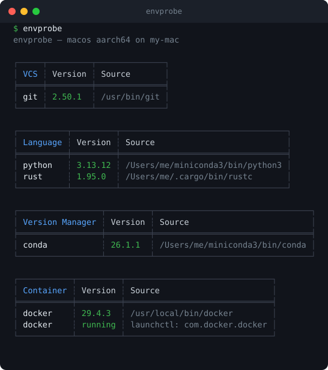

# envprobe

envprobe scans a machine and lists the developer tools, services, and language runtimes that are installed, with their versions. It's a single, dependency-free binary for macOS, Linux, and Windows.



## Install

macOS / Linux:

```bash
curl -fsSL https://raw.githubusercontent.com/HoshiyomiLusia/envprobe/main/install.sh | sh
```

Windows (PowerShell):

```powershell
irm https://raw.githubusercontent.com/HoshiyomiLusia/envprobe/main/install.ps1 | iex
```

## Usage

```bash
envprobe            # scan and print a table
envprobe --json     # JSON output
envprobe --help     # all options
```

MIT licensed.
